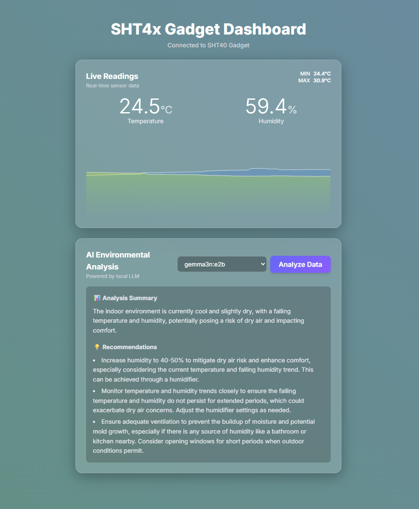
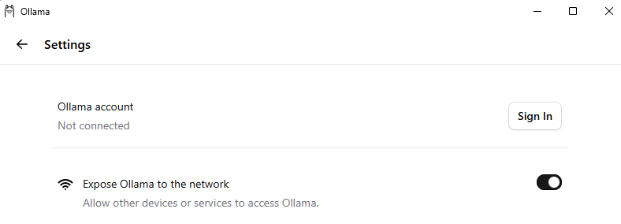

# SHT4x BLE Monitor

A real-time dashboard built entirely within a single HTML page, demonstrating direct connection to user devices via the Web Bluetooth API and integration with a local Large Language Model (LLM) for data analysis.

The project highlights how a simple web page can access local hardware and AI resources, keeping processing and intelligence on the user's machine.



## How It Works

The system is a client-side application that runs entirely in your browser, using modern web APIs to interact with local resources:

*   **Direct Sensor Connection:** Uses the **Web Bluetooth API** to discover, pair with, and subscribe to real-time data streams from the SHT4x sensor.
*   **Real-Time Visualization:** Displays dynamic, historical data charts using Chart.js.
*   **Local AI Analysis:** Communicates with a locally running **Ollama** server via the `fetch()` API. This enables on-demand, privacy-preserving AI analysis of your sensor data.
*   **Actionable Intelligence:** Generates summaries and recommendations by querying a local LLM and parsing its structured JSON response.

## How to Use

1.  **Complete the prerequisites** listed in the "Prerequisites & Setup" section below.
2.  **Open the dashboard page** in a compatible browser (see "Browser Compatibility").
3.  Click the **"Connect to SHT4x"** button.
4.  Select your **SHT4x Smart Gadget** from the browser's Bluetooth device list.
5.  Once connected, the dashboard will display live data.
6.  Click the **"Analyze Data"** button at any time to generate insights from the collected data.

## Browser Compatibility

This application requires a browser that supports the **Web Bluetooth API**. As of late 2025, this includes:
*   Chrome and Edge on Windows, macOS, Linux, and Android.
*   Opera on Windows, macOS, and Android.

> **Note:** Web Bluetooth is not available on iOS/iPadOS browsers. For the most up-to-date compatibility information, please visit [caniuse.com/web-bluetooth](https://caniuse.com/web-bluetooth).

## Prerequisites & Setup

### 1\. The Sensor: SHT4x Smart Gadget

The dashboard requires the highly accurate [Sensirion SHT4x Smart Gadget](https://sensirion.com/products/catalog/SHT4x-Smart-Gadget). It's a reference board that packs a high-precision sensor into a compact BLE device.


> **Note:** Ensure the SHT4x Gadget's Bluetooth is enabled before connecting. You might need to press and hold the button for a few seconds to make it discoverable.

### 2\. The Local AI: Ollama Configuration

The AI analysis relies on a local instance of Ollama running a lightweight model.

#### Installation and Model

1.  **Install Ollama:** Download and install Ollama from the [official website](https://ollama.com/).
2.  **Download a Model:** You'll need a model capable of JSON output and following instructions. While the application will let you choose any model you have installed, a good starting point is a smaller, instruction-tuned model.

    For example, you can pull `gemma3n`:
    ```bash
    ollama pull gemma3n
    ```
    You can explore other models in the [Ollama Library](https://ollama.com/library). The application dynamically loads your installed models into the UI, so feel free to experiment.

#### Cross-Origin Access (Critical Configuration)

When the HTML page is hosted remotely (e.g., on GitHub Pages), it attempts a cross-origin request back to your local computer (`http://localhost:11434`). The Ollama server must be configured to accept this request.

*   **Desktop Application:** Simply check the **"Expose Ollama to the network"** option in the settings.



*   **Command Line:** Set the `OLLAMA_ORIGINS` environment variable. For security, it is strongly recommended to specify the exact origin where the page is hosted. For example, if your dashboard is at `https://your-username.github.io`, use:
    ```bash
    OLLAMA_ORIGINS="https://your-username.github.io" ollama serve
    ```
    For quick local testing, you can use a wildcard (`*`) to allow any origin, but be aware this is insecure and should not be used in a production setting.
    ```bash
    # For development/testing only
    OLLAMA_ORIGINS="*" ollama serve
    ```

This step is mandatory for the AI analysis functionality to work.

## GATT Profile Mappings

The application uses the browser's Web Bluetooth API to connect to the sensor. This requires the use of specific Globally Unique Identifiers (GUIDs) to locate the correct data services and characteristics (the data streams).

| Data Point | Service UUID | Characteristic UUID |
| :--- | :--- | :--- |
| **Humidity** | `00001234-b38d-4985-720e-0f993a68ee41` | `00001235-b38d-4985-720e-0f993a68ee41` |
| **Temperature** | `00002234-b38d-4985-720e-0f993a68ee41` | `00002235-b38d-4985-720e-0f993a68ee41` |

The JavaScript uses `await characteristic.startNotifications()` to subscribe to these GUIDs, enabling the sensor to push real-time data to the browser.
